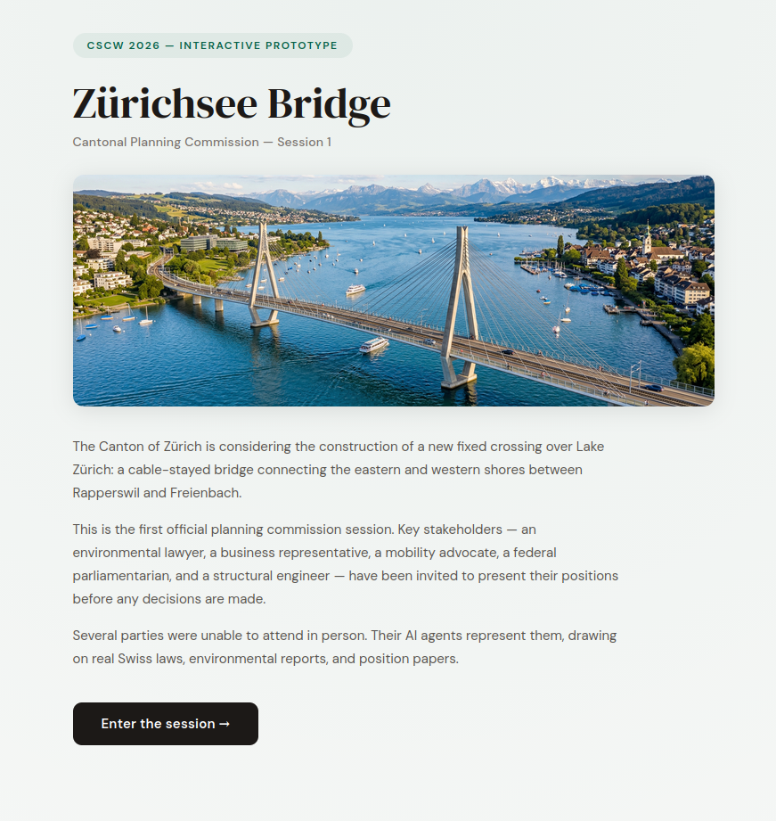
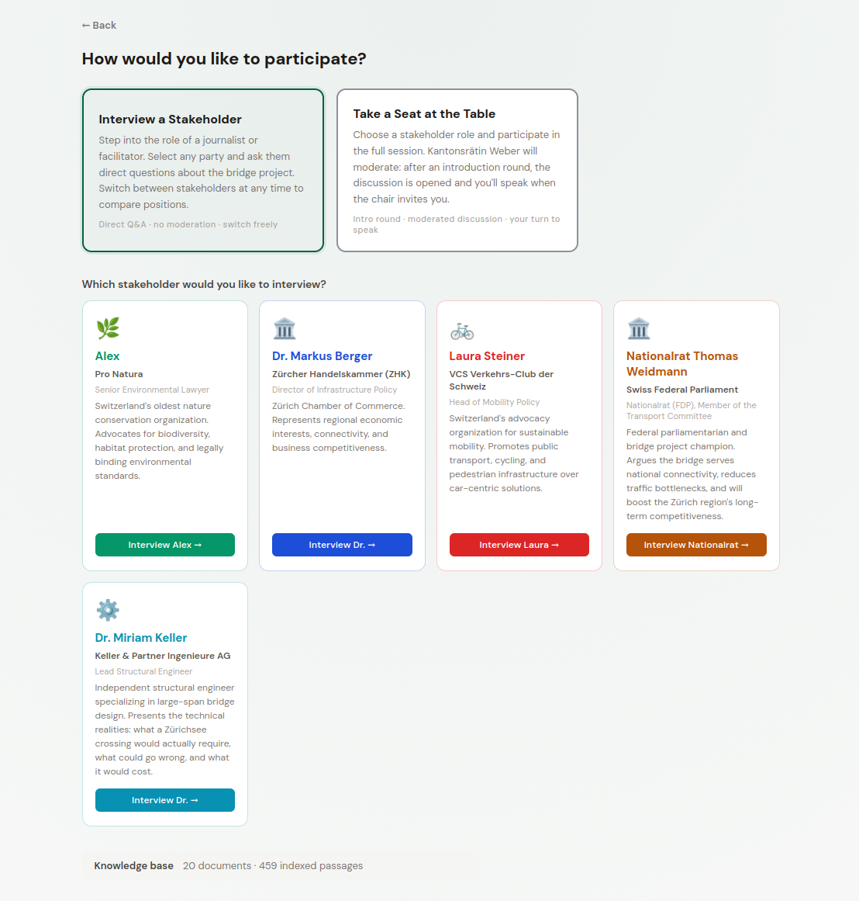
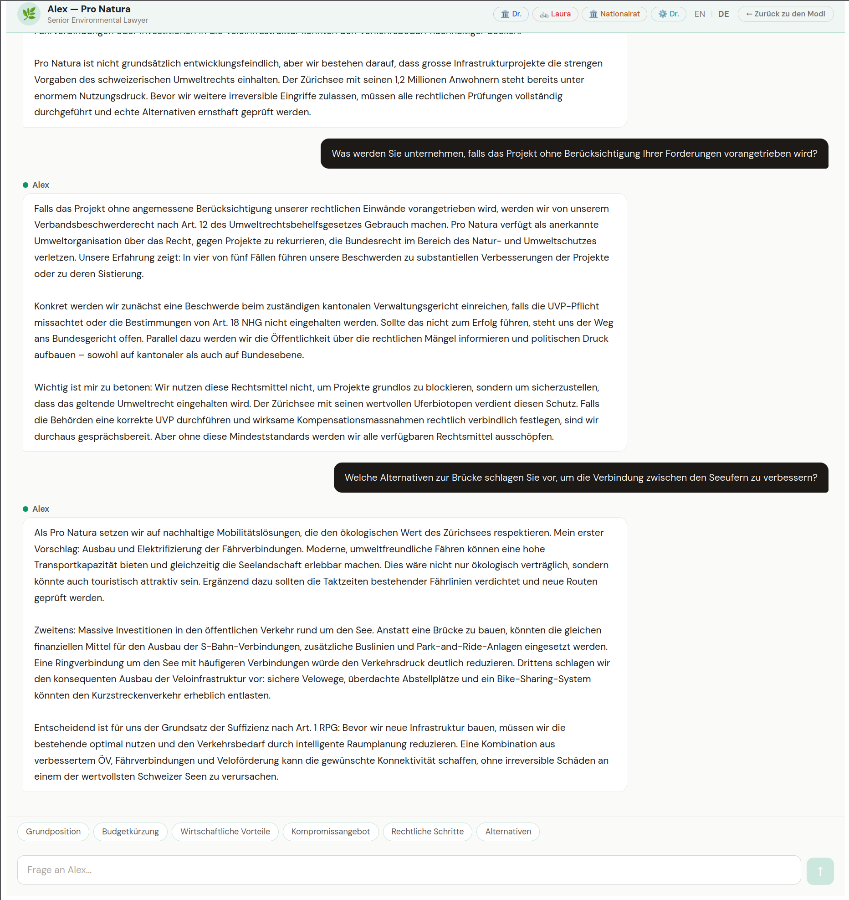

# Zürichsee Bridge — AI Stakeholder Simulation

An interactive prototype for simulating a political planning meeting using AI agents grounded in real documents. Built for CSCW 2026 (University of Zurich) — Homework 3.

---

## The Scenario

The Canton of Zürich is considering the construction of a new fixed crossing over Lake Zürich — a cable-stayed bridge connecting the eastern and western shores between Rapperswil and Freienbach.

This application simulates the first official cantonal planning commission session. Five stakeholders with conflicting interests have been invited to present their positions. Several could not attend in person — their AI agents represent them, drawing on a corpus of real Swiss laws, environmental reports, and position papers.

**Kantonsrätin Maya Weber** chairs the session.



---

## Stakeholders

| Agent | Role | Organisation | Position |
|-------|------|-------------|---------|
| **Alex** | Senior Environmental Lawyer | Pro Natura | Opposes the bridge without legally binding environmental safeguards. Cites NHG Art. 18, GSchG, and the mandatory UVP. Advocates for ferry and public transport alternatives. |
| **Dr. Markus Berger** | Director of Infrastructure Policy | Zürcher Handelskammer | Supports the bridge as essential for regional economic competitiveness. Frames environmental compliance as a proportionate cost, not a veto. |
| **Laura Steiner** | Head of Mobility Policy | VCS Verkehrs-Club der Schweiz | Conditionally supports the bridge only if it is multimodal (bus lanes, cycling, pedestrian paths). Warns against induced car traffic demand. |
| **Nationalrat Thomas Weidmann** | Member of Parliament (FDP), Transport Committee | Swiss Federal Parliament | Champion of the project. Argues it serves the public good, reduces bottlenecks on the A3 and Rapperswil causeway, and that excessive process is itself a political failure. |
| **Dr. Miriam Keller** | Lead Structural Engineer | Keller & Partner Ingenieure AG | Politically neutral technical expert. Presents hard engineering constraints: lake depth up to 136 m, shipping clearances, wind load requirements, 8–12 year construction timeline. |

---

## Two Ways to Engage



### 🎙 Interview a Stakeholder
Take the role of a journalist or facilitator. Select any party and ask direct questions. Switch between stakeholders at any time to compare positions side by side. No moderation — pure Q&A.



> *Try asking all five stakeholders the same question and compare how the same facts from the knowledge base are interpreted differently depending on whose perspective is active.*

### ⚔️ Join the Planning Session
Choose one stakeholder role and take a seat at the table. The session begins with an introduction round where each AI participant briefly introduces themselves. Kantonsrätin Weber then moderates a structured discussion, directing questions at specific participants. When she addresses you, it's your turn to speak.

> *Try playing different roles across multiple sessions — Alex's legal arguments land very differently when you're responding as Dr. Berger than when you're Dr. Keller.*

---

## How It Works: RAG Architecture

This is a **Retrieval-Augmented Generation (RAG)** system. Responses are grounded in a specific document corpus — not generated from the model's general training data.

```
User query
    │
    ▼
TF-IDF Retrieval ──── chunks.json (preprocessed PDFs)
    │
    ▼
Top-5 relevant passages
    │
    ▼
Anthropic API ──── Persona system prompt (who is speaking?)
    │
    ▼
Grounded response
```

**Why this matters:** The same chunk about NHG Art. 18 (habitat protection law) is injected into every stakeholder's context when relevant — but Alex interprets it as a legal weapon, while Dr. Berger treats it as a compliance checkbox. The persona prompt shapes interpretation; the retrieved documents provide the factual grounding.

### Knowledge Base

The document corpus includes:
- Swiss federal laws: NHG, GSchG, USG, RPG, UVPV
- Pro Natura position papers and conservation reports
- VCS mobility studies
- Zürcher Handelskammer infrastructure policy documents
- Federal transport committee materials
- Engineering references for comparable bridge projects

---

## Setup

### Prerequisites
- Node.js 18+
- An [Anthropic API key](https://console.anthropic.com/)

### 1. Install dependencies

```bash
cd backend && npm install
cd ../frontend && npm install
```

### 2. Configure API key

```bash
cd backend
cp .env.example .env
# Add your key: ANTHROPIC_API_KEY=sk-ant-...
```

### 3. Preprocess the document corpus

```bash
cd backend
npm run preprocess
```

This reads all PDFs from `backend/data/pdfs/`, splits them into chunks, and saves `data/chunks.json`. The TF-IDF index is built at server startup from this file.

### 4. Start the backend

```bash
cd backend
npm start
# → http://localhost:3001
```

### 5. Start the frontend

```bash
cd frontend
npm run dev
# → http://localhost:5173
```

---

## Tech Stack

| Layer | Technology |
|-------|-----------|
| Frontend | React + Vite |
| Backend | Node.js + Express |
| Retrieval | TF-IDF via `natural` (npm) |
| PDF parsing | `pdf-parse` |
| LLM | Claude Sonnet (`claude-sonnet-4-20250514`) via Anthropic API |
| Moderation | Separate LLM call, structured JSON output `{message, nextPersonaId}` |

---

## API Endpoints

| Method | Endpoint | Description |
|--------|----------|-------------|
| `POST` | `/api/chat` | Main RAG endpoint — retrieve + generate for a given persona |
| `POST` | `/api/moderate` | Generate a moderator facilitation message |
| `GET` | `/api/personas` | List all available stakeholder agents |
| `GET` | `/api/stats` | Knowledge base statistics |

---

*University of Zurich · CSCW 2026 · Homework 3*
